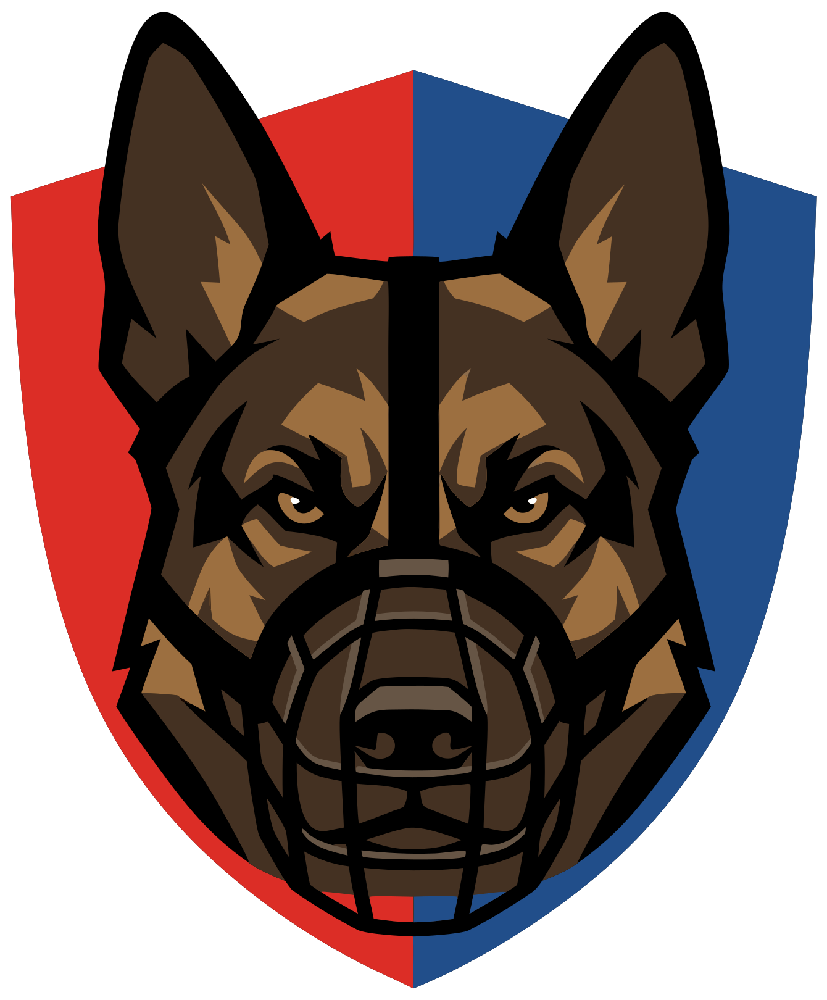

<p align="center">
  
</p>

<h1 align="center">BikeHound</h1>

<p align="center"><strong>Sniffs out your stolen bike on second-hand marketplaces, every day.</strong></p>

<p align="center">
  <a href="https://github.com/wiebe-vandendriessche/bikehound/actions/workflows/ci.yml"></a>
  <a href="LICENSE"></a>
  
</p>

Had your bike stolen? It often shows up for sale online within days or weeks, usually with a
vague title like *"bike for sale"*, no brand and a single photo. Checking every marketplace by
hand, every day, is exhausting. BikeHound does it for you.

Describe your bike once, add a few photos, and BikeHound keeps watch. When a listing looks like
your bike, you get a notification on your phone with a photo and a link.

## Features

- Watches several second-hand marketplaces at once
- Focuses on your area, without ignoring listings further away
- Recognises your bike from its photos, even when the listing says almost nothing
- Still finds your bike when parts like mudguards, stickers or the saddle were changed
- Push notifications on your phone
- Runs automatically every day

## Marketplaces

- 2dehands.be
- Marktplaats.nl
- Vinted (opt-in)
- Leboncoin (planned)
- Facebook Marketplace (opt-in, best effort, no account)

## Usage

BikeHound is a command-line tool you run on your own computer or home server, once a day.
Everything stays local: your photos, the image model and the list of listings already seen.

### 1. Install

You need Linux or macOS, [uv](https://docs.astral.sh/uv/) and about 3 GB of free disk space
(Python packages plus the image model).

```bash
git clone https://github.com/wiebe-vandendriessche/bikehound.git
cd bikehound
uv sync                      # installs Python 3.14 and the dependencies
uv run playwright install chromium   # only for Vinted and Facebook
```

### 2. Create your config

```bash
uv run bikehound init        # writes config.yaml with a private notification topic
```

Open `config.yaml` and describe your bike. Every field is commented; the important ones:

| Field | What to put in it |
|---|---|
| `bike.stolen_on` | The date of the theft. The first run searches back to this date. |
| `bike.frame_number` | Optional. A listing that mentions it always notifies you. |
| `location` | Your postcode, country (`BE` or `NL`) and search radius in km. |
| `platforms` | Which marketplaces to search. Default: `[2dehands, marktplaats]`. |
| `keywords` | Words a seller might use, in every language: `brand`, `model`, `color`, or any group you add. |
| `threshold` | How sure BikeHound must be before it notifies you. Default `0.5`. |

Keyword groups add to the photo score when any of their words appears in the listing:
`brand` 0.3, `model` 0.4, any other group 0.1 unless you set `weight`. Brand plus model is
enough to notify on its own; raise the weight of a rare, distinctive colour.

Words match anywhere in the title and description, so pick words that only your bike's
listings would contain:

- **Avoid short, generic words.** A short word also matches inside longer words and other
  brands' names. Prefer the full name as a phrase, and add the spellings sellers use (with and
  without spaces or dashes).
- **Put the model name in `model`,** not in `brand`.
- **Numbers match whole numbers only:** `28` does not match `280` or `28.5`, but it still
  matches every "28 inch" wheel. Use the full model number instead of a bare number.
- **Check before you run:** `bikehound check` prints how many listings on the first page would
  notify, how many by keywords alone, and which keyword groups fired.

### 3. Add photos of your bike

Put one or more photos in the `reference/` folder (jpg, png or webp). Best: a side view showing
the whole bike, plus close-ups of anything distinctive. No photo of the actual bike? A catalogue
photo of the same model works too, but expects more lookalikes.

### 4. Get notifications on your phone

Install the free [ntfy](https://ntfy.sh) app and subscribe to the topic in the `ntfy.url` line
of your config (the part after `https://ntfy.sh/`). Keep the topic name private: anyone who
knows it can read your notifications.

### 5. Check everything

```bash
uv run bikehound check
```

This validates the config, downloads the image model on first use (about 1.5 GB), sends a test
notification and runs one small search per marketplace. It prints how the photos on that page
score against yours, with the best matches, so you can see whether `threshold` fits.

### 6. Run it every day

```bash
uv run bikehound run
```

The first run searches back to the theft date and can take 20 to 30 minutes. It sends its
matches as a few summary messages instead of one notification each. Later runs only look at new
listings and take a few minutes. Each notification shows the photo, price, score, the reasons
for the score and a link to the listing.

Schedule it with cron (`crontab -e`), for example every morning at 7:

```cron
0 7 * * * cd /path/to/bikehound && $HOME/.local/bin/uv run bikehound run >> data/bikehound.log 2>&1
```

BikeHound refuses to run again within 12 hours of a successful run, so a misconfigured
schedule cannot hammer the marketplaces.

To test by hand, `run --force` skips that guard and `run --platform vinted` (repeatable)
searches only the platforms you name. A run limited with `--platform` does not count for the
guard, so it never makes your scheduled run skip a day.

### Run with Docker instead

Prefer a container? Build the image once, then keep each bike in its own folder (config,
photos and data live there, outside the image):

```bash
docker build -t bikehound .
mkdir mybike
docker run --rm --user "$(id -u):$(id -g)" -v "$PWD/mybike:/bike" bikehound init
# edit mybike/config.yaml, put photos in mybike/reference/, then:
docker run --rm --user "$(id -u):$(id -g)" -v "$PWD/mybike:/bike" bikehound check
```

The image model is downloaded once into `mybike/data/hf/`. The daily cron line becomes:

```cron
0 7 * * * docker run --rm --user 1000:1000 -v /path/to/mybike:/bike bikehound run >> /path/to/mybike/data/bikehound.log 2>&1
```

(use your own `id -u` and `id -g` instead of `1000`). The image runs Chromium headless only;
`BIKEHOUND_HEADED=1` needs a normal install.

### When does it stop?

On `bike.active_until` (default: one year after the theft) it sends one last notification and
stops searching. Move the date to keep searching.

### Good to know

- **A marketplace failed?** You get a notification and that marketplace is skipped for the
  day; the next run tries again. Repeated failures usually mean the site changed.
- **Too many or too few notifications?** Raise or lower `threshold` in steps of 0.05 and look
  at the scores in `bikehound check` and in the notifications.
- **Facebook** is searched logged out, without any account. Facebook shows anonymous visitors
  only a limited view, so BikeHound reads one page per price range plus one search per model
  word. It covers recent listings (no search back to the theft date) in a wide area around
  Brussels (`country: BE`) or Amsterdam (`NL`) that Facebook chooses; `radius_km` does not apply.
  If Facebook starts requiring a login, you get a "facebook failed" notification.
- **Vinted** is searched with BikeHound's own browser profile in `data/profiles/vinted/`,
  logged out. BikeHound never logs in with your account. If Vinted starts blocking it, try
  `BIKEHOUND_HEADED=1` (on a server without a screen: under `xvfb-run`).
- **Several bikes?** Use one config file per bike, each in its own folder, and pass it with
  `uv run bikehound -c path/to/config.yaml run`. Each config gets its own `data/` folder.
- **Your files:** `config.yaml`, `reference/` and `data/` (seen listings, cached photo
  embeddings) are never committed to git. BikeHound stores only listing IDs and scores, never
  texts, photos or seller details.

## Before you use it

- **Terms of service**: many marketplaces don't allow automated access. BikeHound is meant for
  personal use. You are responsible for how you use it.
- **Found your bike?** Don't confront the seller and don't buy your own bike back. Take
  screenshots of the listing and the seller profile and contact the police with your report number.

## Contributing

Contributions are welcome, especially fixes when a marketplace changes and new marketplaces.
Read [CONTRIBUTING.md](CONTRIBUTING.md) first. Report security problems privately as described
in [SECURITY.md](SECURITY.md). Everyone taking part follows the
[Code of Conduct](CODE_OF_CONDUCT.md).

## License

[GNU AGPL-3.0](LICENSE), copyright 2026 Wiebe Vandendriessche